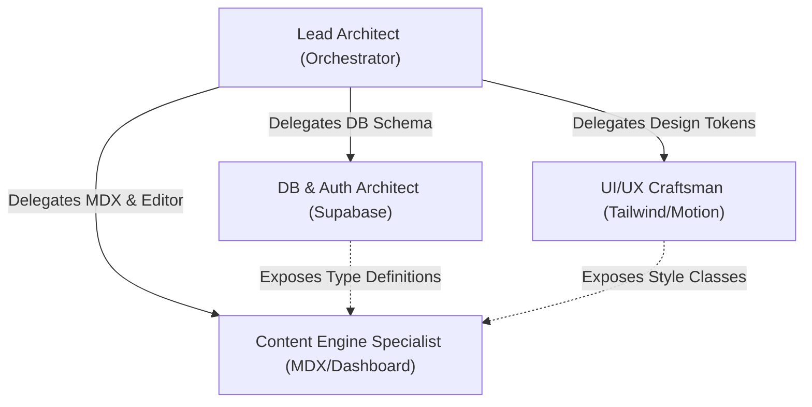

# AI Agent Orchestrator Guide (AGENTS.md)

## Developer Portfolio Orchestration Blueprint

This blueprint outlines how agentic systems (such as Gemini, Antigravity, or other AI coding models) should orchestrate, build, test, and deliver the minimalist, full-stack developer portfolio. It acts as a comprehensive playbook for parallelizable development, code-generation guardrails, and validation protocols.

---

## 1. Multi-Agent Collaboration Roles

When delegating tasks or operating in subagent mode, the execution is divided into four highly specialized developer archetypes:



### A. Lead Architect (System Integrator)
* **Responsibility**: System structure, routing, file management, error boundaries, environment validation, Vercel edge deployment configurations, and Next.js setup.
* **Key Tasks**: Initialize Next.js project, implement middleware route-protection, organize folders.

### B. Database & Auth Architect
* **Responsibility**: Designing and migrating schemas, configuring Row Level Security (RLS) policies, database indexing, and integrating secure Supabase Client APIs.
* **Key Tasks**: Setup Supabase configuration files, write SQL migration scripts, generate TypeScript database interfaces.

### C. UI/UX Craftsman
* **Responsibility**: Pixel-perfect implementation of the design specification, CSS variables, dark/light theme engine, responsive views, interactive components, and animations.
* **Key Tasks**: Configure Tailwind parameters, set up global stylesheets, write Framer Motion components, implement FOUC-proof theme toggles.

### D. Content & Markdown Engine Specialist
* **Responsibility**: Processing rich text, MDX styling, code block tokenization, blog dashboards, and content management components.
* **Key Tasks**: Integrate MDX libraries (e.g., Contentlayer or remote-mdx), setup syntax highlighting (Shiki), design WYSIWYG editor interfaces.

---

## 2. Dynamic Task Prioritization Protocol

To fulfill the user requirement of **using AI to prioritize tasks dynamically**, this orchestrator defines a rule-based framework that agents must execute before starting any coding phase.

### A. The Prioritization Algorithm
When prioritizing, the AI must evaluate each backlog task against three variables:
1. **Critical Path Dependency (D)**: Scale 1–5. Is this task a structural prerequisite for other features? (e.g., Supabase Auth is `5` because Dashboard depends on it. Framer Motion is `1` because nothing depends on it).
2. **User Value (V)**: Scale 1–5. How directly does this task impact the end-user's primary core goals?
3. **Execution Complexity (C)**: Scale 1–5. How likely is this task to introduce bugs, api friction, or deployment blockers?

The dynamic priority weight is computed as:

$$\text{Priority Score} = (D \times 2) + V - \left(\frac{C}{2}\right)$$

### B. The Live Task Backlog (Dynamic Checklist)

The following backlog is pre-computed. If the agent encounters errors or receives modified requirements, it must recalculate the score using the formula above to re-sort the backlog.

* **[Priority: 13.5] Task 1: Foundation Initialization (P0)**
  - Initialize Next.js using native App Router, standard Tailwind configuration, and TypeScript configuration.
  - Setup core file hierarchy and verification commands.
* **[Priority: 12.0] Task 2: Supabase DB & Authentication Setup (P0)**
  - Execute PostgreSQL tables creation, configure RLS, and generate TypeScript database bindings.
  - Build helper scripts for local verification.
* **[Priority: 11.5] Task 3: Global Theme & Layout Structure (P1)**
  - Implement dynamic `next-themes` setup inside the core root layout.
  - Map design CSS variables to the tailwind configuration. Build the standard typography stylesheet.
* **[Priority: 10.0] Task 4: Public Portfolio Engine (P1)**
  - Create standard Project and Blog fetchers using Next.js Server Components.
  - Write standard SEO layout templates using Next.js Metadata API.
* **[Priority: 8.5] Task 5: Protected Dashboard Engine (P2)**
  - Setup admin panel layout with Next.js Middleware auth checks.
  - Write standard Server Actions for Project CRUD operations.
* **[Priority: 6.0] Task 6: MDX & Shiki Syntax Blog System (P2)**
  - Write the parser to convert Supabase raw markdown content into responsive, styled MDX templates.
  - Apply custom Shiki code tokenizers for design aesthetics.
* **[Priority: 4.5] Task 7: Micro-Animations & Polishing (P3)**
  - Apply custom Framer Motion route transitions and responsive magnetic buttons.
  - Setup performance verification sweeps.

---

## 3. Implementation Guardrails for AI Engines

All code edits made by AI agents must strictly follow these structural and design safety rules:

### A. Zero Placeholders Rule
* Never output `// TODO: implement later` or dummy mock variables in final files. 
* All functions must have robust error handling, fully typed interfaces, and correct log reporting.

### B. CSS Variables Rule
* Never write hardcoded hex codes inside component utilities. Use tailwind semantic naming mapped directly to core CSS tokens (e.g. use `bg-background-primary` instead of `bg-[#09090b]`).

### C. Verification Protocols
After writing or editing code, the agent must run the following check commands sequentially to ensure zero build errors before notifying the user:
1. **Type Consistency**: `npx tsc --noEmit`
2. **Syntax Formatting & Linting**: `npm run lint` (or project equivalent)
3. **Production Dry Run**: `npm run build`

---

## 4. Troubleshooting & Self-Correction Engine

If the project encounters errors at any phase, the AI must follow this structured resolution tree:

```
[ BUILD OR RUNTIME ERROR ]
           │
           ├──► 1. Check Console Logs & Stack Trace
           │
           ├──► 2. Are Environment Variables Missing?
           │      └──► Yes: Verify .env.local matches docs/sdd.md definitions
           │
           ├──► 3. Is it a database schema mismatch?
           │      └──► Yes: Read current database state from Supabase CLI
           │
           └──► 4. Re-calculate Task Priority
                  └──► If blocker identified, pause current task, elevate blocker to P0, and resolve.
```
