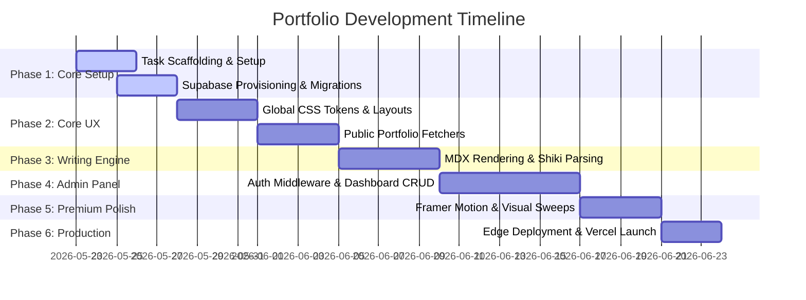

# Project Roadmap & Milestones

## Minimalist Full-Stack Developer Portfolio

This roadmap details the sequential milestones, release phases, and deliverables required to construct, secure, polish, and launch the developer portfolio application.

---

## 1. Roadmap Overview (Timeline at a Glance)

---

## 2. Phase-by-Phase Deliverables

### Phase 1: Core Infrastructure Setup (Milestone 1)
*Goal: Scaffolding, repository structuring, and database seeding.*
- [ ] **Scaffolding Next.js Application**: Initialize the Next.js 15 App Router codebase with TypeScript and ESLint configurations.
- [ ] **Tailwind Setup**: Configure the color schemas and typography tokens inside Tailwind global CSS files.
- [ ] **Supabase Provisioning**: Spin up the Supabase database instance, deploy the migration DDL scripts (profiles, projects, blogs), and configure Row Level Security (RLS) tables.
- [ ] **Local Verification Setup**: Establish verification commands (`npm run lint`, `npx tsc --noEmit`) to ensure build-readiness.

---

### Phase 2: Design Language & Public Pages (Milestone 2)
*Goal: Pixel-perfect, responsive public interface with light/dark theme integration.*
- [ ] **Theme Orchestration**: Set up `next-themes` and create a custom Sun/Moon toggler with system-preference memory and zero layout shift (FOUC).
- [ ] **Landing Page**: Typography-driven hero section with clean typography headers and social media copy-to-clipboard connections.
- [ ] **Projects Showcase Layout**: Real-time interactive grid displaying featured projects with dynamic tag-filtering capabilities.
- [ ] **Blog Post Index**: Clean editorial row-by-row layout listing articles chronologically with date badges and reading time calculations.

---

### Phase 3: Markdown & Writing System (Milestone 3)
*Goal: Compile raw database content into beautifully formatted technical blog posts.*
- [ ] **MDX Parser Integration**: Integrate MDX engine to render technical articles stored in Supabase as valid, styled React elements.
- [ ] **Syntax Highlighting (Shiki)**: Configure Shiki syntax highlighters with customized dark/light themes inside code blocks.
- [ ] **Dynamic Slug Routing**: Setup Next.js App Router dynamic paths (`/blog/[slug]` and `/projects/[slug]`) with Incremental Static Regeneration (ISR) and static metadata population.

---

### Phase 4: Secured Admin Dashboard (Milestone 4)
*Goal: Full CRUD capabilities for projects and blogs via a secure, private dashboard.*
- [ ] **Route Protection Middleware**: Implement a central Edge Middleware to intercept `/admin/*` requests, validating Supabase session tokens and redirecting unauthenticated users to `/login`.
- [ ] **Blog/Project CRUD Forms**: Build visual panels powered by Next.js Server Actions to securely mutate database records.
- [ ] **Asset Storage Pipeline**: Setup visual drag-and-drop file upload linked directly to a private Supabase Storage bucket for cover images.
- [ ] **Interactive WYSIWYG Markdown Editor**: Integrate a sleek markdown textarea with a side-by-side rendering preview panel.

---

### Phase 5: Micro-Animations & Polish (Milestone 5)
*Goal: Elevate the app from a standard site to a state-of-the-art premium experience.*
- [ ] **Page Transitions**: Implement Framer Motion route fade-and-slide up transitions.
- [ ] **Micro-Interactions**: Magnetic hover effects on CTA buttons and morphing SVG togglers.
- [ ] **Performance Audit Sweeps**: Resolve accessibility contrasts and optimize images for a perfect 100/100 Lighthouse score.

---

### Phase 6: Release & Continuous Delivery (Milestone 6)
*Goal: Live production launch, analytics logging, and automated testing.*
- [ ] **Vercel Edge Deployment**: Set up production CI/CD pipelines linked with GitHub to deploy branch previews.
- [ ] **Web Vitals & Monitoring**: Add Vercel Speed Insights to track real-time visitor core metrics.
- [ ] **CI Automation**: Configure GitHub Actions to auto-run lint, format, type checks, and build test suites upon pull request events.
