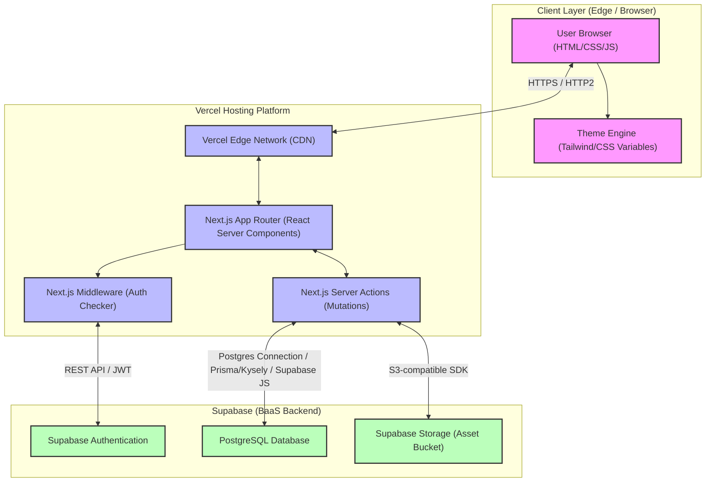
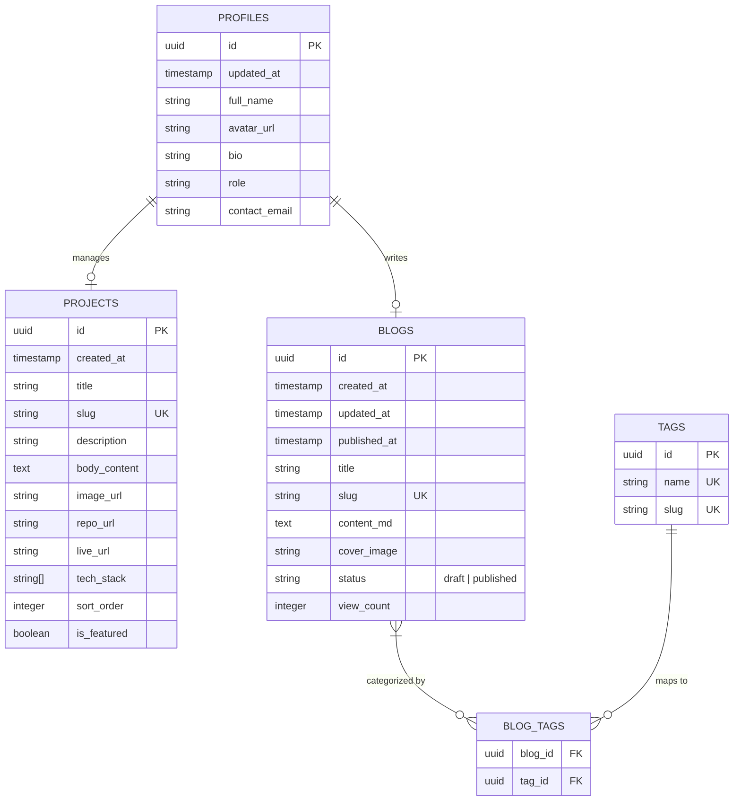

# System Design Document (SDD)

## Minimalist Full-Stack Developer Portfolio

This document provides a deep dive into the system architecture, database design, routing strategy, and infrastructure patterns for the full-stack developer portfolio.

---

## 1. System Architecture Diagram



---

## 2. Rendering & Data Fetching Strategy

To achieve a 100/100 Lighthouse score while maintaining full-stack editability, the architecture leverages a hybrid rendering topology:

* **Static Site Generation (SSG)**: The Landing page, Project Index, and Blog Index pages are fully pre-rendered on the server at build time.
* **Incremental Static Regeneration (ISR)**: When a new project or blog post is updated via the Admin Dashboard, the server triggers **On-Demand Revalidation** via Next.js tag-based or path-based revalidation tags (e.g. `revalidateTag('content')`). This immediately purges the edge cache and regenerates the static page in the background upon the next request.
* **Client-Side Rendering (CSR)**: Used exclusively for interactive micro-components, such as:
  - Theme switching logic (system check + local storage sync)
  - Real-time search filters
  - Form validation states (contact form submissions)
* **React Server Components (RSC)**: Fetch data directly from Supabase via high-efficiency database queries inside server components, eliminating client-side API requests and lowering cumulative layout shift (CLS).

---

## 3. Database Schema Design (PostgreSQL)

The persistence layer runs on **Supabase PostgreSQL**. We will track migration scripts in version control. The schema consists of 4 main tables:



### PostgreSQL DDL Schema Script
```sql
-- Create profile table linking directly to Supabase Auth
create table profiles (
  id uuid references auth.users on delete cascade primary key,
  updated_at timestamp with time zone default timezone('utc'::text, now()) not null,
  full_name text not null,
  avatar_url text,
  bio text,
  role text,
  contact_email text
);

-- Enable Row Level Security (RLS) for profiles
alter table profiles enable row level security;

create policy "Public profiles are viewable by everyone." on profiles
  for select using (true);

create policy "Users can update their own profile." on profiles
  for update using (auth.uid() = id);

-- Create projects table
create table projects (
  id uuid default gen_random_uuid() primary key,
  created_at timestamp with time zone default timezone('utc'::text, now()) not null,
  title text not null,
  slug text unique not null,
  description text not null,
  body_content text,
  image_url text,
  repo_url text,
  live_url text,
  tech_stack text[] not null default '{}',
  sort_order integer default 0 not null,
  is_featured boolean default false not null
);

alter table projects enable row level security;

create policy "Projects are readable by public" on projects
  for select using (true);

create policy "All operations permitted by authenticated admins" on projects
  for all using (auth.role() = 'authenticated');

-- Create blogs table
create table blogs (
  id uuid default gen_random_uuid() primary key,
  created_at timestamp with time zone default timezone('utc'::text, now()) not null,
  updated_at timestamp with time zone default timezone('utc'::text, now()) not null,
  published_at timestamp with time zone,
  title text not null,
  slug text unique not null,
  content_md text not null,
  cover_image text,
  status text not null default 'draft' check (status in ('draft', 'published')),
  view_count integer default 0 not null
);

alter table blogs enable row level security;

create policy "Published blogs are readable by public" on blogs
  for select using (status = 'published');

create policy "Admins can perform all actions on blogs" on blogs
  for all using (auth.role() = 'authenticated');
```

---

## 4. API & Mutative Logic (Next.js Server Actions)

All state updates (such as adding/deleting projects or publishing blogs) will bypass traditional REST API routes and utilize secure **Next.js Server Actions**. This ensures type-safe forms and minimizes client-side javascript load.

### Directory Structure & Server Actions Map
```
src/
├── app/
│   ├── actions/
│   │   ├── projects.ts      # Server actions: createProject, updateProject, deleteProject
│   │   ├── blogs.ts         # Server actions: createBlog, updateBlog, deleteBlog
│   │   └── auth.ts          # Server actions: login, logout
```

Example implementation model for revalidation in `src/app/actions/blogs.ts`:
```typescript
'use server'

import { createClient } from '@/utils/supabase/server'
import { revalidatePath, revalidateTag } from 'next/cache'

export async function publishBlog(id: string) {
  const supabase = await createClient()
  
  const { data, error } = await supabase
    .from('blogs')
    .update({ status: 'published', published_at: new Date().toISOString() })
    .eq('id', id)
    .select()

  if (error) throw new Error(error.message)

  // Immediately invalidate static cache for paths listing blogs
  revalidatePath('/blog')
  revalidatePath(`/blog/${data[0].slug}`)
  revalidateTag('blogs')
  
  return data[0]
}
```

---

## 5. Security & Authentication Model

1. **Role-Based Routing Isolation**: A global `middleware.ts` runs at the Vercel Edge layer. It intercepts any requests heading to `/admin/*`, decodes the Supabase JWT, and immediately redirects unauthenticated requests back to `/login`.
2. **Database Hardening via RLS**: Every table has Row Level Security (RLS) policies configured. Only active, JWT-verified admin accounts can mutate tables, while the public can read only `published` blogs and active projects.
3. **Environment Variable Security**: All API keys, DB access credentials, and secret strings are configured strictly in Vercel/Local `.env.local` files and are never bundled into the client-side packages. All variables exposed to the client start with `NEXT_PUBLIC_`.

---

## 6. Storage Model (Supabase Storage)

* **Bucket Name**: `portfolio-assets`
* **Visibility**: Public (all assets can be resolved via unique Supabase CDN links).
* **Access Policies**:
  - `Select`: Publicly readable by anyone.
  - `Insert/Update/Delete`: Restrained strictly to Authenticated Admin Users.
* **Optimization Pipeline**: When upload events complete via Server Actions, images are served with dynamic cache-control headers (`public, max-age=31536000, immutable`) to reduce edge network load.
